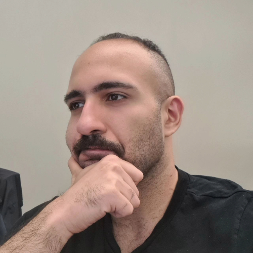

Welcome — I’m Aria Pessianzadeh
======
I’m a PhD student in Information Science at Drexel University, working at the intersection of Natural Language Processing, Computational Social Science, and AI for Society.
My work blends large-scale data analysis, generative AI, and human-centered research to better understand how people experience technology—and how we can design systems that empower rather than divide us.
Whether I’m studying trust in large language models, analyzing polarization in online communities, or prototyping tools that encourage healthier digital conversations, I’m driven by a single goal: using AI to help people understand each other, not drift further apart.
In my spare time, I workout, listen to podcasts, watch shows, learn new languages and follow politics!

A data-driven personal website
======
Like many other Jekyll-based GitHub Pages templates, Academic Pages makes you separate the website's content from its form. The content & metadata of your website are in structured markdown files, while various other files constitute the theme, specifying how to transform that content & metadata into HTML pages. You keep these various markdown (.md), YAML (.yml), HTML, and CSS files in a public GitHub repository. Each time you commit and push an update to the repository, the [GitHub pages](https://pages.github.com/) service creates static HTML pages based on these files, which are hosted on GitHub's servers free of charge.

Many of the features of dynamic content management systems (like Wordpress) can be achieved in this fashion, using a fraction of the computational resources and with far less vulnerability to hacking and DDoSing. You can also modify the theme to your heart's content without touching the content of your site. If you get to a point where you've broken something in Jekyll/HTML/CSS beyond repair, your markdown files describing your talks, publications, etc. are safe. You can rollback the changes or even delete the repository and start over -- just be sure to save the markdown files! Finally, you can also write scripts that process the structured data on the site, such as [this one](https://github.com/academicpages/academicpages.github.io/blob/master/talkmap.ipynb) that analyzes metadata in pages about talks to display [a map of every location you've given a talk](https://academicpages.github.io/talkmap.html).

Research: Trust, Technology, and Social Systems
======
My research explores the linguistic, psychological, and social signals that shape how people interact with generative AI.
I develop computational models to study:

Stance, sentiment, and emotion in discussions about GenAI

Trust and distrust mechanisms, drawing on TAM, DOI, PMT, SET, and cognitive–affective trust theories

Online polarization, controversial issues, and cross-community attitudes

Cultural tightness–looseness and AI adoption

Second-order influence of AI agents in group deliberation

Much of my work relies on large, real-world datasets (primarily Reddit), multi-label annotation pipelines, and quantitative frameworks for mapping trust pathways and identifying emergent trust profiles across populations.
My goal is to advance transparent, responsible, and human-centered AI systems

Building Tools for Better Conversations
------
Alongside my research, I build practical tools that apply NLP and generative AI to democratic and societal challenges.
My projects include:

An anti-polarization chatbot that helps people engage with opposing viewpoints more constructively.

Argument-surfacing and civility-scoring systems that support healthier political dialogue.

AI-assisted debate environments with multiple LLM agents facilitating group reasoning.

Interactive platforms for dating, learning, and community-building, powered by contextual LLM moderation.

I believe AI should act as a bridge—not a wedge—between people.
My work seeks to move us toward technologies that reduce division, foster empathy, and strengthen civic life.

**A Humanistic Vision for AI and Society**

At the center of everything I do is a commitment to empowering people.
I’m deeply inspired by the immigrant experience, the idea of American possibility, and the belief that technology should enhance our humanity rather than replace it.
My long-term vision combines research, entrepreneurship, and public engagement to build systems that are:

Fair, transparent, and trustworthy

Politically and culturally sensitive

Designed to support conversation, connection, and community

I’m building a career at the intersection of research and impact—where rigorous science meets real societal challenges.

